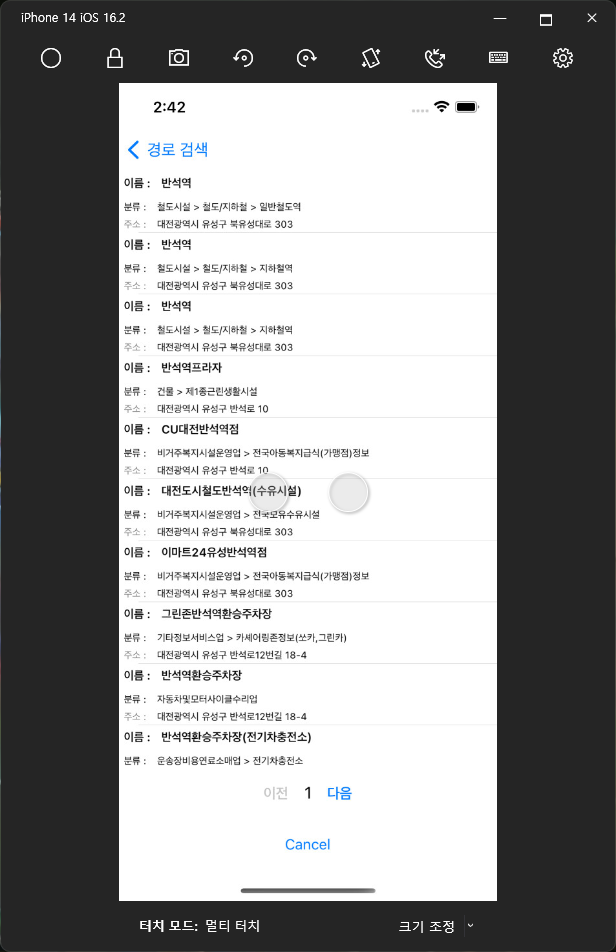

# MaaS Arcgis IOS 용
IOS application 을 위해 제작된 code.

아래는 화면 및 이슈 사항 정리.

### page ( simulation )
+ login 화면
  

+ 기본 화면

+ menu

+ 경로 찾기 화면

+ 경로 찾기 후 Navigiation 중인 화면

+ 경로 찾기 후 Navigation 종료된 화면

+ SSR 화면

+ 설정 화면

### 기타 이슈
+ ios raw gnssMeasurment 는 ios 보안이슈로 인하여 접근이 불가능하여 데이터 추출이 안됨.
+ ios bluetoothle 의 경우 시험테스트 필요.
+ 2023.02.25 key 발급 및 2023.02.26 확인 완료
  + vworld open api key 사용 ( 만료일 : 2023.05.25 )

### Simulation Build 준비 사항
+ MacOS
  + ip 정보. 컴퓨터 켤떄 쓰는 아이디 및 비밀번호 정보
  + Xcode app 설치
  + Mono library 설치 ( brew 사용등. 안해도 됨 )
  + 유선 네트워크 연결
  + 설정->일반->공유->remote login->접근 권한 활성화

+ Window
  + Visual studio 2019 이상 필요
  + 유선 네트워크 연결

### Window 에서 Simulation build 
1. Mac 페어링
   + MacOS 컴퓨터의 IP , 아이디 및 비밀번호 정보를 사용하여 접근
      + 자세한 사항은 visual studio 도움말 참고
   + 페어링 시도 및 mono library 원격 설치 진행
   + 페어링 완료
2. 코드 작성
3. 빌드
   + 아래의 그림과 같이 설정.
     
   + 국제화에 west 반드시 활성화 및 나머지도 동일하게 설정.
     
   + 그 후 build

### Window 에서 실제 build
+ USB 를 통한 실제 ios phone 물리적 연결 수행.
+ apple developer account 활성화
  + visual studio -> 도구 -> option -> xamarin -> apple 계정 -> 추가 -> enterprise 계정 -> 등록 진행
+ build 및 debugging 진행.

